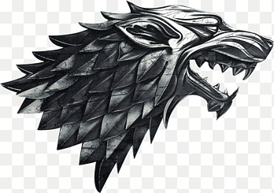

# 📜 Game of Thrones AI Chatbot

### 🔥 A Fully Custom RAG + LLM Chatbot with Character Voices, Lore-Based Answers & Stunning Streamlit UI

  

This project is a **Game of Thrones conversational AI chatbot** powered by:

- **RAG (Retrieval-Augmented Generation)**
- **ChromaDB vector embeddings**
- **Local sentence-transformer embeddings**
- **OpenAI GPT for response generation**
- **Selectable character voices (Tyrion, Jon Snow, Arya, Daenerys, Cersei, Raven)**
- **Dark-theme, avatar-based Streamlit UI**

The chatbot answers **strictly using the Game of Thrones lore PDF you provide** and rejects out-of-universe questions.

---

# ⚔️ Features

### 🧙 Lore-Grounded RAG Responses

- Answers only from your GOT PDF (no external hallucinations)
- Strict rules ensure lore consistency
- Rejects questions unrelated to GOT universe

### 🎭 Character Mode

Respond in the tone of:

- Tyrion Lannister
- Jon Snow
- Arya Stark
- Daenerys Targaryen
- Cersei Lannister
- Raven (neutral)

### 🎨 Stunning Streamlit UI

- Dark mode
- Avatar icons
- Left/right aligned chat bubbles
- GOT banner styling
- Clean headers & typography

### 🧠 Long-Term Memory Engine

Stores important conversation facts (configurable).

### ⚙️ Fast Vector Search (ChromaDB + Sentence Transformers)

- PDF → Text → Chunks → Embeddings
- Local vector store (not uploaded to GitHub)
- Real-time similarity search

---

# 📂 Project Structure
